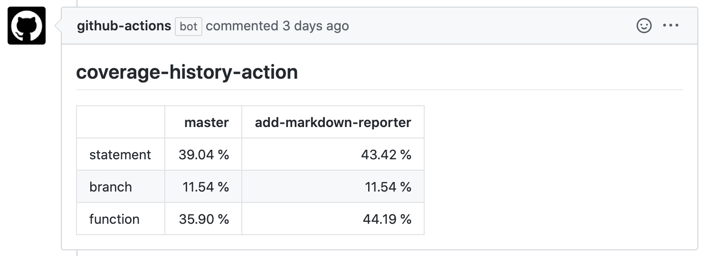

# Coverage History Action


This GitHub Actions notice coverage history in pull request comments.




# Usage
```yml
name: coverage-history


on:
  push:
    branches:
      - "**"
  pull_request:
    types: [opened, synchronize]


jobs:
  report:
    runs-on: ubuntu-latest

    steps:
    - uses: actions/checkout@v2
    - name: Use Node.js 12.x
      uses: actions/setup-node@v1
      with:
        node-version: 12.x
    - name: yarn install
      run: |
        yarn install --frozen-lockfile
      env:
        CI: true
    - name: Run test
      run: |
        yarn test
      env:
        CI: true
    - name: Coverage History Action
      uses: odanado/coverage-history-action@v0
      with:
        github-token: ${{ secrets.GITHUB_TOKEN }}
```